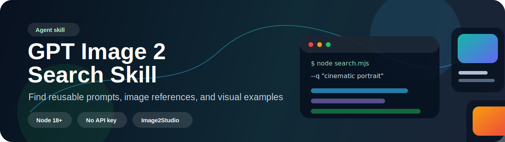

<p align="center">
  <a href="https://image2studio.com/prompts">
    
  </a>
</p>

<h1 align="center">GPT Image 2 Search Skill by Image2Studio</h1>

<p align="center">
  Agent-ready prompt search for GPT Image 2, ChatGPT image generation, and Image2Studio visual references.
</p>

<p align="center">
  <a href="skills/gpt-image-2-search/SKILL.md"></a>
  <a href="https://image2studio.com/prompts"></a>
  <a href="https://nodejs.org"></a>
  <a href="https://image2studio.com/prompts"></a>
  <a href="https://github.com/Ryan-yang125/gpt-image-2-prompts"></a>
</p>

Agent skill for searching GPT Image 2 prompts, image references, and visual examples from Image2Studio.

This repository packages a single search skill for agents and Codex workflows that need reusable ChatGPT image generation prompts, example images, style references, composition patterns, or prompt inspiration. It is designed as a lightweight discovery layer before an agent writes, rewrites, compares, or adapts a GPT Image 2 prompt.

## Included Skill

- `gpt-image-2-search` - search the public Image2Studio GPT Image 2 prompt library by concise visual keywords.

## Use Cases

- Find prompt inspiration for a product shot, portrait, poster, scene, character, icon, UI image, or social media visual.
- Look up examples for a visual style, medium, mood, lighting setup, camera language, or composition.
- Collect reference images before writing or refining an image-generation prompt.
- Compare prompt structures and adapt a strong example to a new subject or brand direction.
- Recover from vague requests by searching for nearby visual language first.

## Related Projects

- [gpt-image-2-prompts](https://github.com/Ryan-yang125/gpt-image-2-prompts) - curated GPT Image 2 prompt gallery with 1,000 prompt-image pairs.
- [Image2Studio prompt gallery](https://image2studio.com/prompts) - full searchable GPT Image 2 prompt library and web editor.

## Install

Install only this skill:

```bash
npx skills add ryan-yang125/gpt-image-2-skills --skill gpt-image-2-search
```

Install the whole repository:

```bash
npx skills add ryan-yang125/gpt-image-2-skills
```

## Quick Start

Run a local search:

```bash
node skills/gpt-image-2-search/scripts/search.mjs --q "cinematic portrait" --limit 3 --markdown
```

Search from inside the skill directory:

```bash
cd skills/gpt-image-2-search
node scripts/search.mjs --q "luxury perfume ad" --limit 5 --markdown
```

The command requires Node.js 18 or newer because it uses the built-in `fetch` API. No API key is required.

## CLI Options

| Option | Description |
| --- | --- |
| `--q`, `-q` | Search keywords. Required. Use short visual phrases. |
| `--limit` | Results per page. Defaults to `8`, capped at `20`. |
| `--page` | Page number. Defaults to `1`. |
| `--category` | Filter by category. |
| `--language` | Filter by prompt language. |
| `--featured` | Filter featured prompts with `true` or `false`. |
| `--api-base` | Override the API base URL. Useful for testing. |
| `--markdown` | Print a compact Markdown summary instead of raw JSON. |

## Agent Workflow

1. Convert the user's request into 2-4 English visual keywords.
2. Search with `node scripts/search.mjs --q "<keywords>" --limit 8 --markdown`.
3. Check whether the results match the subject, format, style, lighting, composition, and intended use.
4. If the match is weak, retry once with broader or adjacent terms.
5. Present the strongest results with title, relevance, prompt excerpt, `imageUrl`, and `studioUrl`.

Good search phrases are concrete and visual:

```text
cinematic portrait
minimal product poster
anime character sheet
luxury perfume ad
editorial fashion photo
surreal architecture
```

## Output Fields

Search results may include:

| Field | Purpose |
| --- | --- |
| `title` | Human-readable prompt title. |
| `description` | Short summary of what the prompt creates. |
| `prompt` | Reusable prompt text. |
| `imageUrl` | Reference image URL. |
| `studioUrl` | Web editor URL for opening the prompt. |
| `categories` | Prompt categories or tags. |
| `stats` | Weak popularity signal; do not rank only by this. |

## Project Structure

```text
skills/
`-- gpt-image-2-search/
    |-- SKILL.md
    |-- references/
    |   `-- api.md
    `-- scripts/
        `-- search.mjs
```

## Development

Run the smoke test:

```bash
node skills/gpt-image-2-search/scripts/search.mjs --q "cinematic portrait" --limit 3 --markdown
```

Validate a structured response:

```bash
node skills/gpt-image-2-search/scripts/search.mjs --q "cinematic portrait" --limit 2 \
  | node -e 'let s=""; process.stdin.on("data", d => s += d); process.stdin.on("end", () => { const j = JSON.parse(s); console.log({count: j.results.length, total: j.total, first: j.results[0]?.title}); });'
```
